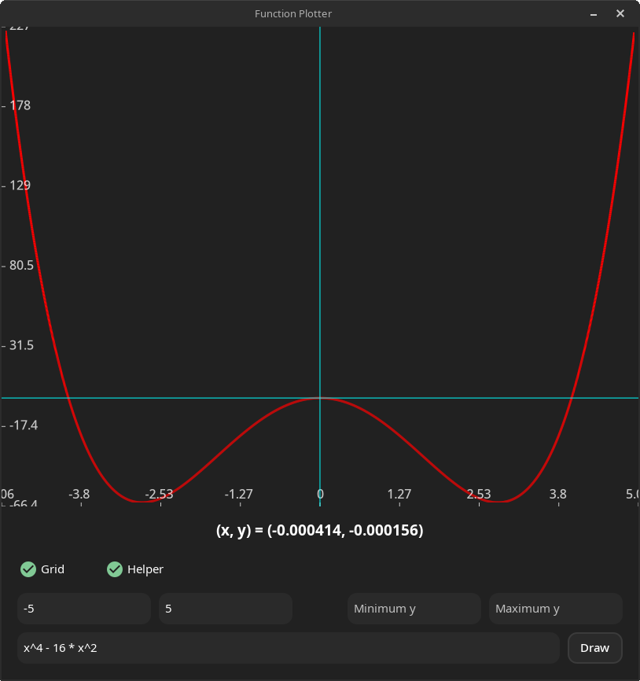
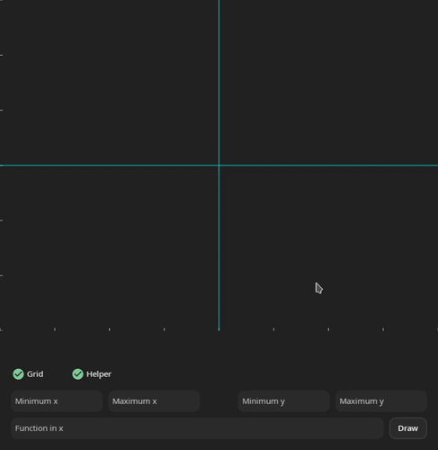
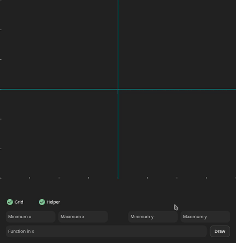

<p align="center">

  

</p>

## Features

* Using open source GTK platform, meaning that the program can be configured to work on different operating systems.
* Plotting arbitrary polynomials containing only numbers, 'x', and operators ('+', '-', '*', '/', '^').
* Input validation and error handling. Explanations for different errors will be provided.
* Inspection of plots using the mouse. If you click and drag over a certain point, you will get its coordinates.

## Getting Started

To get started with the program, you need to compile it first. Compiling is as easy as running the following:

```shell
./compile_and_run.sh
```

You can also run compilation separately from running as follows:

```shell
make
./*.exe
```

## Examples

<details><summary>Working Examples</summary>
<p align="center">

  

  

  

</p>
</details>

<details><summary>Extra Features</summary>
<p align="center">

  

  

</p>
</details>

<details><summary>Errors</summary>
<p align="center">

  

  

</p>
</details>
